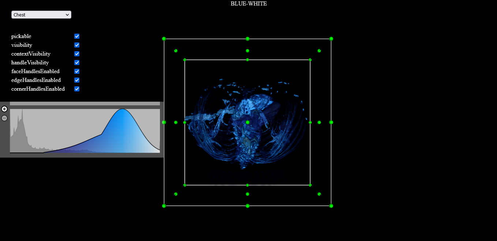

# Medical Visualization WebApp

This is a  Web GUI application that does 3D visualization of DICOM series Using VTK.js library.

## Website Link

### <a href= "https://zeyad-alo.github.io/Medical-Visualization-Webapp/dist/index.html">🔗 Click Here</a>

TEAM MEMBERS:
- Zeyad Mansour
- Daniel Rafik
- Youssef Saad
- Abdelrahman Kamal

PROJECT OUTCOME:
- First, our main page is a dropdown for the user to choose if he wants to look at the chest or the head.
.png)

- Then, if the user chooses the head, he’ll find a 3D figure of a skull with a slider at the top left of the screen to be able to control the iso value. 
.png)
.png)

- Then, if the user chooses the chest, he will find a 3D figure of a chest skeleton with some points on each plane of the 3 graphs of the figure to be able to control cutting volume and a checkbox to be able to control some features of the chest. 
.png)
.png)

- The BONUS part of the transfer function was also completed.

ISSUES FACED:
- One of the project’s requirements is that the project should be written in java script. We had a problem because we have never done anything with java script before, even in this course, all our work was in C++ so we had a problem dealing with this new language. 

- The selection function used to render the volume on top of already existing volumes every time the user changes selection. This was solved by removing all objects in the render window first before rendering the new volume. 

- Problems revolving around html formatting and styling, appropriate CSS styling was used to reach desired look. 
